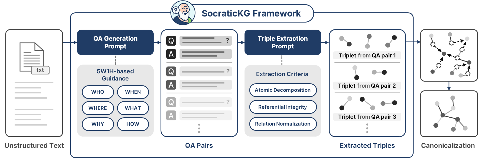

<div align="center">


[](https://2026.aclweb.org/)
[](https://arxiv.org/pdf/2601.10003.pdf)
[](https://arxiv.org/abs/2601.10003)
[](LICENSE)
[](https://www.python.org/)

[Paper](https://arxiv.org/abs/2601.10003) · [Quick Start](#quick-start) · [Results](#results) · [Citation](#citation)

<br>


</div>

---

## Overview

**SocraticKG** introduces question-answer pairs as a structured intermediate representation between raw text and extracted triples. Rather than prompting an LLM to extract triples in a single pass, we first generate self-contained QA pairs guided by the **5W1H framework** (*who, what, when, where, why, how*), then extract atomic triples from each unit.

This interrogative scaffold systematically surfaces implicit causal and procedural dependencies that direct extraction misses — producing graphs that are more complete *and* more structurally coherent, resolving the long-standing trade-off between factual coverage and connectivity.

---

## Method

The pipeline consists of three stages:

**1. 5W1H-Guided QA Generation** <br>
The document is decomposed into self-contained, context-independent QA pairs. The 5W1H framework serves as an analytical lens that surfaces procedural and causal content alongside surface-level facts. All referential expressions (pronouns, definite descriptions) are resolved so that each QA pair stands alone as an extraction unit.

**2. Triple Extraction from QA** <br>
Each QA pair is independently mapped to atomic `(entity₁, relation, entity₂)` triples. Operating on logically self-contained units narrows the semantic boundary of each extraction step and reduces errors typical of single-pass pipelines.

**3. Canonicalization** <br>
Extracted triples are unified through an embedding-based cluster-then-refine procedure combining K-means clustering, hybrid dense-sparse retrieval (BM25 + cosine), and LLM-based synonym resolution — producing a compact, coherent graph with consolidated entities and relations. We adopt the 
canonicalization procedure from [KGGen (Mo et al., 2025)](https://arxiv.org/abs/2502.09956).

---

## Results

### Factual Retention on MINE (%)

| Method | Qwen-2.5 | GPT-4o-mini | GPT-4o | Gemini-2.5 | Claude-4 |
|:---|:---:|:---:|:---:|:---:|:---:|
| Direct Extraction | 66.5 | 68.5 | 78.1 | 84.6 | 86.8 |
| GraphRAG | 59.7 | 49.5 | 49.3 | 48.5 | 52.3 |
| KGGen | 56.7 | 44.3 | 66.4 | 62.5 | 69.1 |
| SoKG (w/o 5W1H) | 67.1 | 80.5 | 83.5 | 85.6 | 94.6 |
| **SoKG (Ours)** | **73.4** | **83.9** | **89.3** | **87.7** | **96.3** |

### Multi-hop Reasoning on HotpotQA Hard Bridge (%)

| Method | Qwen · 2-hop | Qwen · 3-hop | Claude · 2-hop | Claude · 3-hop |
|:---|:---:|:---:|:---:|:---:|
| Direct Extraction | 19.50 | 23.88 | 37.87 | 39.88 |
| GraphRAG | 23.00 | 25.00 | 46.62 | 52.12 |
| KGGen | 16.50 | 18.50 | 38.25 | 46.75 |
| Naive RAG | — | 20.13 | — | 47.88 |
| **SocraticKG** | **23.62** | **27.00** | **48.50** | **56.38** |

SocraticKG is the only KG-based method that **consistently outperforms Naive RAG** across all backbones and retrieval depths.

---

## Evaluation

All evaluation scripts — factual retention scoring on MINE and the 
downstream HotpotQA protocol — are used **as-is** from the official 
[KGGen repository](https://github.com/stair-lab/kg-gen), with no 
modifications. This ensures that every method reported in the Results 
tables is scored under an identical protocol.

We thank the KGGen authors ([Mo et al., 2025](https://arxiv.org/abs/2502.09956)) 
for open-sourcing their evaluation framework.

---

## Quick Start
```# Set up credentials
cp .env.example .env
# → edit .env with your API key

# Run the full pipeline
python -m socratickg.run --dataset kyssen/kg-gen-evaluation-essays

# Or step-by-step
python -m socratickg.run --steps extract
python -m socratickg.run --steps canonicalize
```

### Installation

```bash
git clone https://github.com/LABA-SNU/SocraticKG.git
cd SocraticKG
pip install -r requirements.txt
```

### Environment

The pipeline uses an OpenAI-compatible API client, so you can point it at
any compatible endpoint — OpenAI, OpenRouter (for Claude / Gemini / Qwen),
or a local vLLM / LiteLLM server.

```bash
cp .env.example .env
# Edit .env with your credentials
```

Required variables:
- `OPENAI_API_KEY` — your API key
- `OPENAI_BASE_URL` — endpoint URL (default: `https://api.openai.com/v1`)
- `MODEL_NAME` — model identifier (e.g. `gpt-4o`, `anthropic/claude-sonnet-4`)

### Minimal Example

```python
# Programmatic usage (after pip installing dependencies)
from pathlib import Path
from socratickg.extraction import run_extraction
from socratickg.canonicalization import run_canonicalization
from socratickg.config import build_output_dirs
from datasets import load_dataset

dirs = build_output_dirs(Path("outputs/my_run"))
dataset = load_dataset("your/dataset")["train"]

run_extraction(dataset, dirs["qa"], dirs["raw_triples"], dirs["usage"])
run_canonicalization(dirs["raw_triples"], dirs["final_triples"])
```

### Reproducing Paper Results

```bash
# MINE benchmark (factual retention)
python scripts/run_mine.py --model claude-4 --method sokg

# HotpotQA downstream evaluation (multi-hop reasoning)
python scripts/run_hotpotqa.py --model claude-4 --hop 3
```

---

## Repository Structure

```
SocraticKG/
├── socratickg/
│   ├── __init__.py
│   ├── config.py               # Env-based configuration
│   ├── llm_client.py           # OpenAI client + JSON parser
│   ├── prompts.py              # Prompt templates
│   ├── extraction.py           # Step 1: 5W1H QA + triple extraction
│   ├── canonicalization.py     # Step 2: entity & relation unification
│   └── run.py                  # CLI entry point
├── prompts/
│   ├── QA Generation_w_5W1H.txt
│   ├── QA Generation_wo_5W1H.txt
│   ├── Extract_Triples_from_QA.txt
│   └── Extract_Triples_from_Text.txt
├── assets/
│   ├── banner.svg
│   └── main_figure.png
├── requirements.txt
├── .env.example
├── LICENSE
└── README.md
```

---

## Citation

```bibtex
@article{choi2026socratickg,
  title={SocraticKG: Knowledge Graph Construction via QA-Driven Fact Extraction},
  author={Choi, Sanghyeok and Jeon, Woosang and Yang, Kyuseok and Kim, Taehyeong},
  journal={arXiv preprint arXiv:2601.10003},
  year={2026}
}
```

---

<div align="center">
<sub>LABA @ Seoul National University</sub>
</div>
